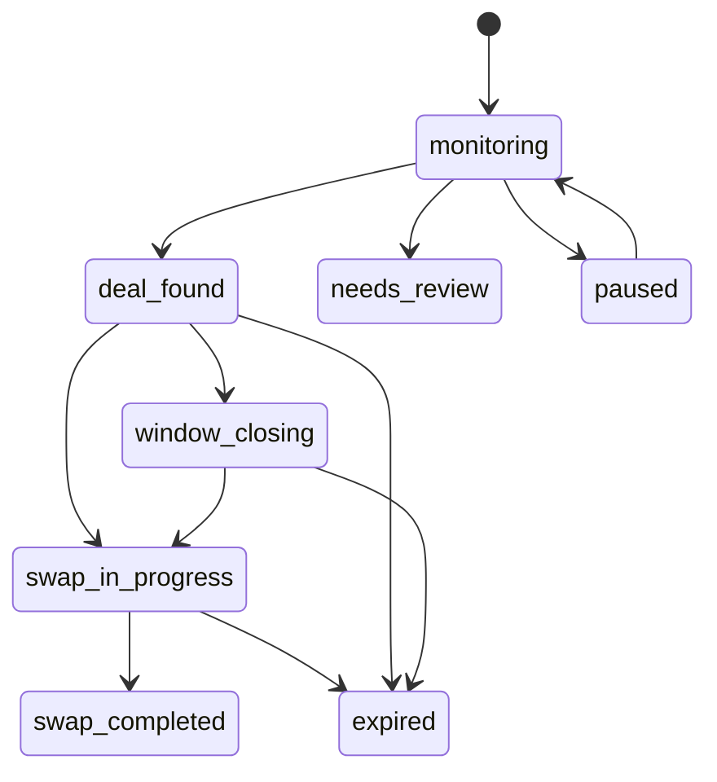
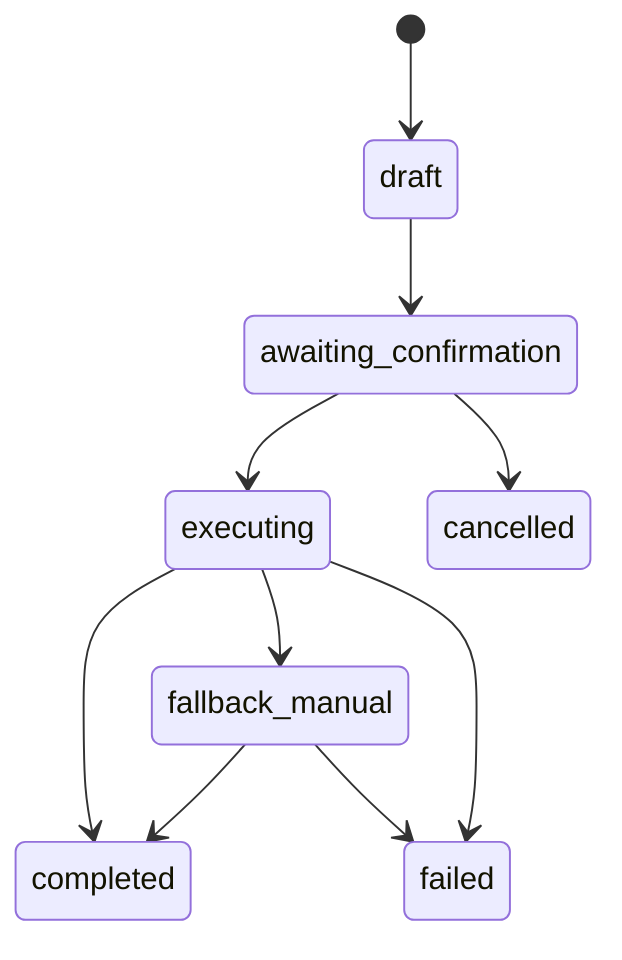

# AfterSave Requirements Schema v2

## 1) Purpose

This document turns the current product requirements into an implementation-ready, canonical schema contract for V1.  
It is intentionally implementation-agnostic so it can be mapped to DB tables, API DTOs, or JSON Schema.

Source requirements:
- `ProductRequirements/Architecture.md`
- `ProductRequirements/SwapPage.md`
- `ProductRequirements/PurchaseLists`
- `ProductRequirements/ProductAreas.md`

## 2) Canonical Modeling Decisions

- `Purchase` is the source-of-truth input for deal discovery and UI rendering.
- Discovery output is modeled separately as `DealCandidate`.
- Swap workflow state is modeled separately as `SwapExecution`.
- Transparency/compliance events are modeled as `AuditEvent`.
- User and merchant controls that affect ranking/gating are explicit (`UserPreferences`, `MerchantReliability`).

## 3) Global Data Type Defaults

Defaults close open ambiguities in requirements and are configurable.

- `timestamp`: ISO-8601 UTC string (example: `2026-02-16T14:03:22Z`)
- `money`: integer minor units + ISO 4217 currency (example: `129900` + `USD`)
- `score`: decimal `0.0..1.0`
- `duration_seconds`: integer seconds
- `country`: ISO 3166-1 alpha-2 (example: `US`, `DE`)
- `url`: absolute HTTPS URL string

Config defaults:
- `window_closing_threshold_seconds`: `21600` (6h)
- `low_extraction_confidence_threshold`: `0.75`
- `semi_automation_reliability_threshold`: `0.80`
- `recent_captcha_lookback_seconds`: `259200` (72h)
- `default_minimum_savings_minor`: `1000` (currency minor units, configurable by locale)

## 4) Enumerations

### 4.1 PurchaseStatus

- `monitoring`
- `deal_found`
- `window_closing`
- `swap_in_progress`
- `swap_completed`
- `expired`
- `needs_review`
- `paused`

### 4.2 MatchTier

- `exact`
- `attribute`
- `similar`

### 4.3 SwapExecutionMode

- `manual`
- `semi_automated`

### 4.4 SwapSequencePolicy

- `buy_second_cancel_first` (recommended)
- `cancel_first_buy_second` (user-enabled with safeguards)

### 4.5 IssueType

- `low_confidence`
- `missing_order_id`
- `merchant_not_supported`
- `captcha_blocked`
- `out_of_stock`

### 4.6 SwapExecutionStatus

- `draft`
- `awaiting_confirmation`
- `executing`
- `fallback_manual`
- `completed`
- `failed`
- `cancelled`

### 4.7 AuditEventType

- `purchase_detected`
- `data_extracted`
- `deals_evaluated`
- `recommendation_generated`
- `swap_started`
- `swap_step_completed`
- `swap_failed`
- `swap_completed`
- `monitoring_paused`
- `monitoring_resumed`

## 5) Entity Definitions

## 5.1 Purchase

Required:
- `purchase_id: string`
- `account_id: string`
- `merchant: string`
- `order_id: string`
- `purchase_time: timestamp`
- `country: string`
- `currency: string`
- `total_paid_minor: integer`
- `status: PurchaseStatus`
- `monitoring_enabled: boolean`
- `extraction_confidence_score: score`
- `created_at: timestamp`
- `updated_at: timestamp`

Optional:
- `merchant_logo_url: url`
- `primary_item_title: string`
- `delivery_estimate: timestamp | {start_at: timestamp, end_at: timestamp}`
- `cancellation_window_end: timestamp`
- `cancellation_window_inferred: boolean`
- `cancellation_window_confidence: score`
- `last_scan_at: timestamp`
- `issues: IssueType[]`

Derived/UI fields (materialized or computed):
- `cancellation_window_remaining_seconds: duration_seconds`
- `best_deal_summary: BestDealSummary`

## 5.2 PurchaseItem

Required:
- `purchase_item_id: string`
- `purchase_id: string`
- `title: string`
- `quantity: integer` (>= 1)
- `price_minor: integer` (>= 0)
- `attributes: object<string,string>`
- `created_at: timestamp`
- `updated_at: timestamp`

## 5.3 DealCandidate

Required:
- `deal_id: string`
- `purchase_id: string`
- `merchant_or_seller: string`
- `listing_url: url`
- `match_tier: MatchTier`
- `base_price_minor: integer`
- `shipping_minor: integer`
- `tax_estimate_minor: integer`
- `total_price_minor: integer`
- `delivery_estimate: timestamp | {start_at: timestamp, end_at: timestamp}`
- `reliability_score: score`
- `net_savings_minor: integer`
- `savings_percentage: number`
- `last_checked_at: timestamp`
- `in_stock_flag: boolean`
- `stock_confidence: score`
- `cross_border: boolean`
- `created_at: timestamp`
- `updated_at: timestamp`

Optional:
- `return_policy_summary: string`
- `coupon: { code: string, auto_apply_flag: boolean }`
- `ranking_explanation: string`

## 5.4 SwapExecution

Required:
- `swap_execution_id: string`
- `purchase_id: string`
- `selected_deal_id: string`
- `mode: SwapExecutionMode`
- `sequence_policy: SwapSequencePolicy`
- `status: SwapExecutionStatus`
- `acknowledgement_checked: boolean`
- `final_start_confirmed: boolean`
- `created_at: timestamp`
- `updated_at: timestamp`

Optional:
- `started_at: timestamp`
- `completed_at: timestamp`
- `fallback_reason: string`
- `failure_reason_code: string`
- `failure_detail: string`
- `steps: SwapExecutionStep[]`

`SwapExecutionStep`:
- `step_id: string`
- `label: string`
- `status: "pending" | "running" | "completed" | "failed"`
- `started_at?: timestamp`
- `finished_at?: timestamp`
- `detail?: string`

## 5.5 AuditEvent

Required:
- `audit_event_id: string`
- `purchase_id: string`
- `type: AuditEventType`
- `timestamp: timestamp`
- `label: string`
- `created_at: timestamp`

Optional:
- `detail: string`
- `actor_user_id: string`
- `metadata: object<string,unknown>`

## 5.6 UserPreferences

Required:
- `preferences_id: string`
- `account_id: string`
- `allow_similar_items: boolean`
- `marketplace_sellers_allowed: boolean`
- `used_refurbished_allowed: boolean`
- `allow_cross_border: boolean`
- `minimum_savings_minor: integer`
- `shipping_parity_required: boolean`
- `default_execution_mode: SwapExecutionMode`
- `created_at: timestamp`
- `updated_at: timestamp`

Optional:
- `auto_open_from_notification: boolean`
- `quiet_hours: {start_local: string, end_local: string}`

## 5.7 MerchantReliability

Required:
- `merchant_reliability_id: string`
- `merchant_key: string`
- `country: string`
- `reliability_score: score`
- `captcha_events_lookback_count: integer`
- `ui_drift_events_lookback_count: integer`
- `successful_navigation_rate: score`
- `updated_at: timestamp`

## 5.8 BestDealSummary

Optional object attached to `Purchase` list/detail surfaces:
- `best_net_savings_minor: integer`
- `best_savings_pct: number`
- `best_deal_total_price_minor: integer`
- `last_scan_at: timestamp`
- `evaluated_deals_count: integer`

## 6) Relationships and Cardinality

- `Purchase (1) -> (N) PurchaseItem`
- `Purchase (1) -> (N) DealCandidate`
- `Purchase (1) -> (N) AuditEvent`
- `Purchase (1) -> (N) SwapExecution` (at most one active: `draft|awaiting_confirmation|executing|fallback_manual`)
- `UserPreferences (1) -> (N) Purchase` by `account_id`
- `MerchantReliability (1) -> (N) DealCandidate` by `merchant/country`

## 7) State Machines

### 7.1 Purchase lifecycle



### 7.2 Swap execution lifecycle



## 8) Validation Invariants

Core invariants:
- Savings is always computed total-to-total:
  - `net_savings_minor = purchase.total_paid_minor - deal.total_price_minor`
- `deal.total_price_minor = base_price_minor + shipping_minor + tax_estimate_minor`
- `purchase.status = "window_closing"` when `cancellation_window_remaining_seconds < window_closing_threshold_seconds`

Gating invariants:
- If `purchase.extraction_confidence_score < low_extraction_confidence_threshold`, swap initiation is blocked until user confirms key fields:
  - `merchant`, `order_id`, `primary_item_title|items`, `total_paid_minor`
- `match_tier = "similar"` candidates are hidden unless `allow_similar_items = true`
- `cross_border = true` candidates are hidden unless `allow_cross_border = true`
- `mode = "semi_automated"` allowed only when:
  - `deal.reliability_score >= semi_automation_reliability_threshold`
  - `merchant.captcha_events_lookback_count = 0` in lookback window

Safety invariants:
- No irreversible action is executed unless:
  - `acknowledgement_checked = true`
  - `final_start_confirmed = true`
- `sequence_policy = "cancel_first_buy_second"` requires:
  - fresh stock verification passed (`in_stock_flag = true`)
  - explicit risk warning displayed and accepted

Fail-soft invariants:
- On CAPTCHA, UI drift, or stock change during execution:
  - stop semi-automation
  - transition `SwapExecution.status -> fallback_manual`
  - append `AuditEvent` with reason

Multi-item invariants:
- Per-item swap allowed always.
- Whole-order swap allowed only when every `PurchaseItem` has a validated mapped deal.

## 9) Ranking Rules

Default ranking comparator (in order):
1. `match_tier` priority: `exact > attribute > similar`
2. higher `net_savings_minor`
3. delivery parity (equal/faster than original first)
4. higher `reliability_score`
5. more recent `last_checked_at`

## 10) Canonical API Payload Examples

### 10.1 Purchases List row

```json
{
  "purchase_id": "pur_01JH3M3D1YQJ4N",
  "merchant": "Amazon",
  "merchant_logo_url": "https://cdn.aftersave.com/merchant/amazon.png",
  "primary_item_title": "Sony WH-1000XM5",
  "purchase_time": "2026-02-14T10:24:00Z",
  "country": "US",
  "currency": "USD",
  "total_paid_minor": 34999,
  "delivery_estimate": {
    "start_at": "2026-02-17T00:00:00Z",
    "end_at": "2026-02-18T00:00:00Z"
  },
  "cancellation_window_end": "2026-02-16T18:00:00Z",
  "cancellation_window_remaining_seconds": 12480,
  "cancellation_window_inferred": true,
  "cancellation_window_confidence": 0.82,
  "status": "window_closing",
  "monitoring_enabled": true,
  "extraction_confidence_score": 0.91,
  "best_deal_summary": {
    "best_net_savings_minor": 4200,
    "best_savings_pct": 12.0,
    "best_deal_total_price_minor": 30799,
    "evaluated_deals_count": 8,
    "last_scan_at": "2026-02-16T13:50:20Z"
  },
  "issues": []
}
```

### 10.2 Swap details payload

```json
{
  "purchase": {
    "purchase_id": "pur_01JH3M3D1YQJ4N",
    "merchant": "Amazon",
    "order_id": "113-9981234-4456778",
    "purchase_time": "2026-02-14T10:24:00Z",
    "country": "US",
    "currency": "USD",
    "total_paid_minor": 34999,
    "status": "deal_found",
    "extraction_confidence_score": 0.91
  },
  "items": [
    {
      "purchase_item_id": "pit_01JH3M4WQ8G8SJ",
      "title": "Sony WH-1000XM5",
      "attributes": { "brand": "Sony", "color": "Black" },
      "quantity": 1,
      "price_minor": 34999
    }
  ],
  "deals": [
    {
      "deal_id": "deal_01JH3M97B3S2FT",
      "merchant_or_seller": "Best Buy",
      "listing_url": "https://www.bestbuy.com/site/...",
      "match_tier": "exact",
      "base_price_minor": 28999,
      "shipping_minor": 999,
      "tax_estimate_minor": 1801,
      "total_price_minor": 31799,
      "delivery_estimate": "2026-02-18T00:00:00Z",
      "coupon": { "code": "SAVE10", "auto_apply_flag": false },
      "reliability_score": 0.87,
      "net_savings_minor": 3200,
      "savings_percentage": 9.14,
      "last_checked_at": "2026-02-16T13:55:44Z",
      "in_stock_flag": true,
      "stock_confidence": 0.94,
      "cross_border": false
    }
  ],
  "swap_execution": {
    "swap_execution_id": "swp_01JH3MB7GV8W07",
    "selected_deal_id": "deal_01JH3M97B3S2FT",
    "mode": "semi_automated",
    "sequence_policy": "buy_second_cancel_first",
    "status": "awaiting_confirmation",
    "acknowledgement_checked": true,
    "final_start_confirmed": false
  },
  "audit_events": [
    {
      "audit_event_id": "aev_01JH3M3YJ5K7BV",
      "type": "deals_evaluated",
      "timestamp": "2026-02-16T13:55:44Z",
      "label": "8 deals evaluated"
    }
  ]
}
```

## 11) Migration Notes (from current implicit contracts)

- Normalize enum casing to snake/lowercase for transport consistency:
  - `Exact|Attribute|Similar` -> `exact|attribute|similar`
  - `Manual|Semi-Automated` -> `manual|semi_automated`
- Shift all price fields to `*_minor` integer format; preserve `currency`.
- Keep `Purchase` and `DealCandidate` fields required per requirements; allow optional fields only where explicitly specified.
- Keep existing list/detail page contracts but serve them from one canonical model:
  - list view reads derived `BestDealSummary`
  - details view reads `Purchase + PurchaseItem + DealCandidate + SwapExecution + AuditEvent`
- Add explicit `SwapExecution` entity to model confirmation gates and fail-soft transitions.
- Add explicit `MerchantReliability` and `UserPreferences` dependencies for automation/matching gates.

## 12) Acceptance Checklist

- All required purchase/deal fields from requirements are represented.
- Both Purchases List and Swap Details are supported from canonical entities.
- Lifecycle and HITL gates are encoded as constraints.
- Ambiguous thresholds/types are resolved with explicit defaults and marked configurable.
